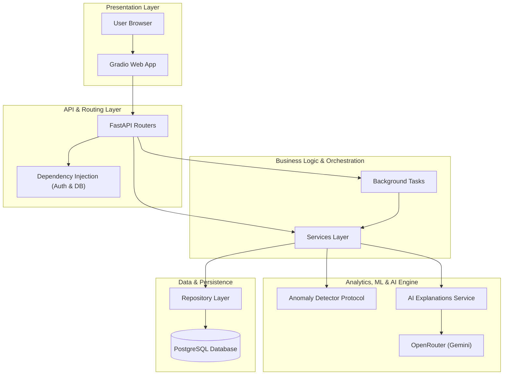
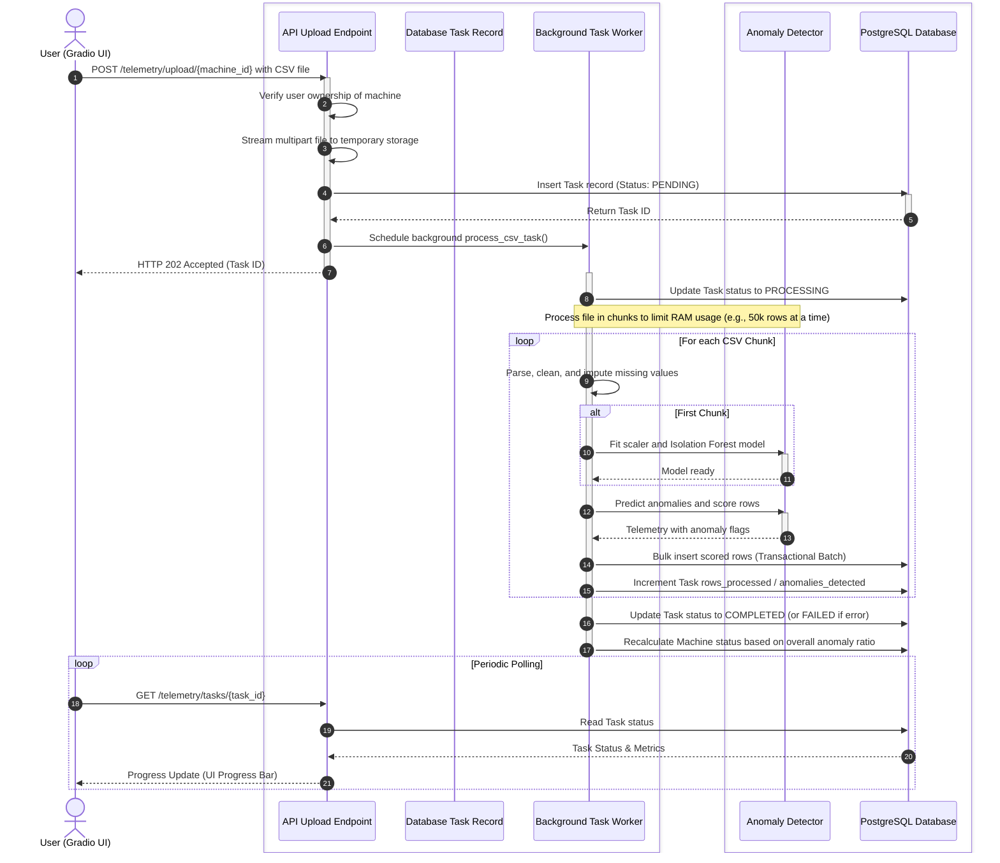

# Technical Architecture

This document describes the architectural layout, core design patterns, component relationships, and primary data flows of the Predictive Maintenance Platform.

---

## 1. High-Level Layered Architecture

The system follows a strict **Layered and Dependency-Inverted** architecture. Each layer depends only on the interface and schemas defined by the layers below it, preventing circular dependencies and ensuring high testability.



---

## 2. Layer Responsibilities

### ⚙️ Core (`app/core`)
Houses cross-cutting concerns that span the entire application lifecycle:
- **Configuration (`config.py`)**: Powered by Pydantic Settings, providing a validated single source of truth for environments.
- **Database Engine (`database.py`)**: Manages the asynchronous SQLAlchemy engine and provides database session dependencies.
- **Security (`security.py`)**: Implements password hashing via BCrypt and handles asymmetric JWT payload sign/verify tasks.
- **Structured Logging (`logging.py`)**: Uses structured logging formats (console-optimized in local dev, raw JSON in production).
- **Exceptions (`exceptions.py`)**: Defines custom typed application exceptions, which are mapped to HTTP responses automatically by global middleware handlers.

### 📦 Database Models (`app/models`)
Contains standard declarative SQLAlchemy 2.0 classes using strict `Mapped[...]` typing. A key abstraction is the custom `GUID` column type: it maps to PostgreSQL's native `UUID` in production, but transparently fallbacks to `CHAR(32)` on SQLite, enabling fast, isolated testing.

### 📝 Serialization Schemas (`app/schemas`)
Pydantic v2 schemas that define the system's external-facing REST API contract. These are isolated from database models to ensure internal fields (such as credential hashes) never leak over the wire.

### 💾 Repositories (`app/repositories`)
Implements the Repository Pattern to isolate database operations from business logic.
- **`BaseRepository[Model]`**: Provides standard CRUD actions (`get`, `list`, `count`, `create`, `update`, `delete`).
- **Entity Repositories**: Extend the base class to implement specific operations (e.g., bulk inserts, status summarizations).

> [!IMPORTANT]
> **Repositories do not manage transactions.** Session commits and rollbacks are owned by the API dependency lifecycle or the background worker orchestrator. This guarantees predictable, unit-of-work transactional boundaries.

### 🧠 Service Orchestration (`app/services`)
Owns domain business rules and coordinates data operations. Services compile inputs, call appropriate repositories, and interact with the Machine Learning and GenAI pipelines.

### 🔌 API Routers (`app/api`)
Thin wrappers built on FastAPI routers. They leverage Dependency Injection (`DbSession`, `CurrentUser`) to check permissions, pass validated schemas down to Services, and translate service outputs into standard JSON payloads.

---

## 3. Telemetry Ingestion Pipeline

The ingestion pipeline handles large-scale file streaming, real-time ML scoring, and asynchronous persistence.



### 💡 Core Ingestion Decisions

- **Bounded RAM Usage**: Millions of telemetry records are parsed incrementally using `pandas.read_csv(chunksize=...)` to prevent memory exhaustion in small container runtimes.
- **Transactional Batches**: Each chunk is committed in its own database transaction. If processing fails mid-stream, previously persisted chunks remain valid, and the system logs an explicit error message on the associated Task record.
- **Dynamic Unsupervised Training**: Anomaly detection models are trained on the fly using the initial chunk of the CSV payload, establishing a local baseline of standard operations for that specific ingestion run.

---

## 4. Anomaly Detection Engine

The ML engine is decoupled from the ingestion pipeline via the `AnomalyDetector` interface (`Protocol`):

```python
class AnomalyDetector(Protocol):
    def fit(self, features: np.ndarray) -> None: ...
    def predict(self, features: np.ndarray) -> DetectionResult: ...
    @property
    def is_fitted(self) -> bool: ...
```

### 🌲 Isolation Forest Detector (`scikit-learn`)
This is the default production implementation. It scales numerical features via `StandardScaler` and applies an ensemble of isolation trees. The raw `decision_function` values are inverted and min-max scaled into a probability-like `[0, 1]` anomaly score. An anomaly is flagged when the score exceeds the defined model boundary. Built models are serialized using `joblib` and persisted inside the `MODEL_DIR` for later evaluation.

### 📊 Statistical Z-Score Detector
A secondary, lightweight statistical model. It identifies outlier rows where feature values deviate beyond a configurable standard deviation threshold. It serves as a dependable fallback for simple deployments or offline tests.

---

## 5. GenAI Diagnostics & Fallbacks

The `AIService` translates unstructured telemetry streams into actionable insights.

1. **Context Compaction**: The service collects the latest sensor reading trends (mean, min, max) and isolates a small subset of anomaly events (up to 15 records).
2. **LLM Orchestration**: It constructs a structured system prompt asking for a JSON diagnostic report (including `summary`, `explanation`, and `recommendations`).
3. **Resilient Failovers**:
    - **Primary Model**: `google/gemini-2.5-pro` (via OpenRouter).
    - **Secondary Fallback**: `google/gemini-2.5-flash` (if the primary times out or returns rate limits).
    - **Local Deterministic Explainer**: If the API key is missing or unreachable, a rules engine dynamically analyzes metrics deviations (e.g. comparing temperatures to statistical margins) to output deterministic instructions.

---

## 6. Architectural Trade-offs & Future Enhancements

### 1. Backend In-Process Worker
- **Current**: FastAPI's default `BackgroundTasks` processes uploads on the active worker thread.
- **Trade-off**: Requires no extra dependencies (like Redis/RabbitMQ), keeping the stack minimal. However, heavy CPU processing can slow down API responsiveness.
- **Future**: Swap the execution handler for a standalone task broker (e.g., Celery, Arq, or Redis Queue) to decouple heavy processing tasks entirely.

### 2. File-Based Model Management
- **Current**: Scikit-learn models are written directly to local disk volumes (`MODEL_DIR`).
- **Trade-off**: Extremely fast read/write access. However, horizontal scaling across multiple replicas requires shared volumes.
- **Future**: Introduce an S3-compatible object storage layer or model registry (like MLflow) to store and load model artifacts.

### 3. High-Volume Telemetry Storage
- **Current**: Telemetry events are stored in a standard relational PostgreSQL table.
- **Trade-off**: Simple index schemas (`machine_id`, `timestamp`) cover current query paths. However, tables can grow by gigabytes under constant machine monitoring.
- **Future**: Implement PostgreSQL table partitioning by month, or transition the telemetry schema into a specialized time-series storage engine (like TimescaleDB).
