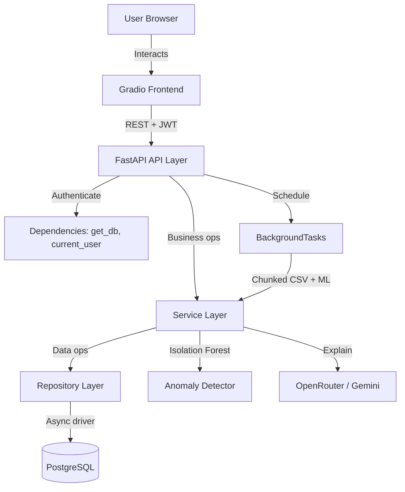
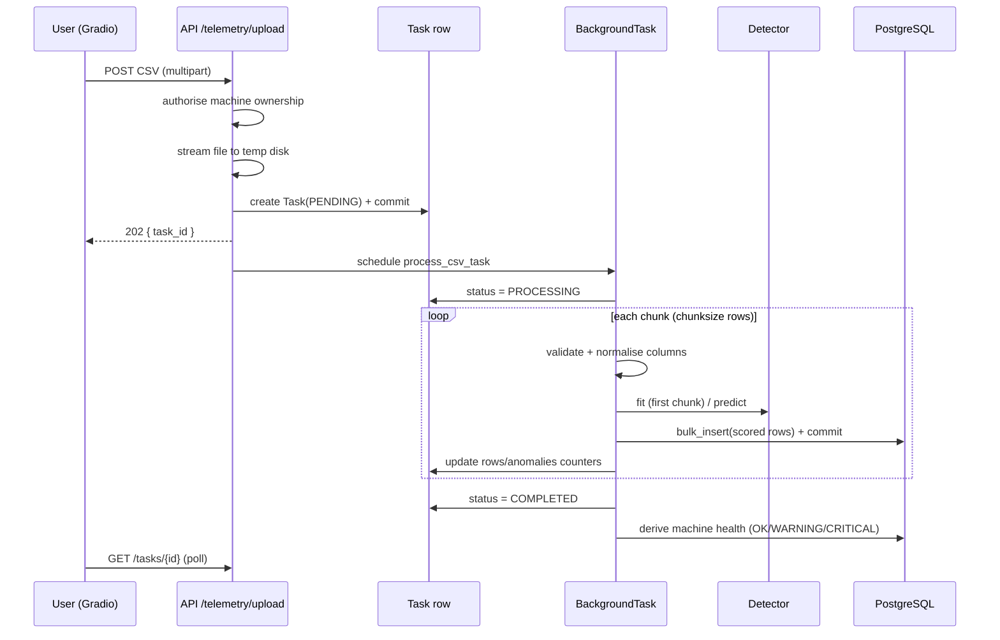

# Architecture

This document describes the technical design of the Predictive Maintenance
platform: its layers, data flow, key decisions, and trade-offs.

## 1. High-level overview



The system is a **layered, dependency-inverted** application:

```
API (routers)  ->  Services (business logic)  ->  Repositories (data access)  ->  ORM / DB
                       |                              ^
                       v                              |
              Anomaly Detector / AI                Models
```

Each layer depends only on the one below it. Routers are thin; services own
business rules; repositories encapsulate queries; models define the schema.

## 2. Layers

### Core (`app/core`)
Cross-cutting concerns: `config` (Pydantic Settings, single source of truth),
`database` (async engine + session dependency), `security` (bcrypt + JWT),
`logging` (structlog: console in dev, JSON in prod), and `exceptions` (typed
`AppException` hierarchy mapped to HTTP responses by registered handlers).

### Models (`app/models`)
SQLAlchemy 2.0 declarative models with typed `Mapped[...]` columns. A portable
`GUID` type (native `UUID` on Postgres, `CHAR(32)` elsewhere) lets the same
models run on SQLite in tests. Mixins provide `id` and `created_at/updated_at`.

### Schemas (`app/schemas`)
Pydantic v2 request/response models. Separated from ORM models so the API
contract evolves independently and never leaks internal fields (e.g. password
hashes).

### Repositories (`app/repositories`)
A generic `BaseRepository[Model]` provides `get / list / count / create /
update / delete`, with model-specific repos adding scoped queries
(`get_for_owner`, `bulk_insert`, `stats_for_machine`, …). **Repositories never
commit** — transaction boundaries belong to the `get_db` dependency and the
background task, giving a single, predictable place for commit/rollback.

### Services (`app/services`)
Business logic and orchestration: `AuthService`, `MachineService`,
`TelemetryProcessor` / `process_csv_task`, `AIService`, and the pluggable
anomaly detectors. Services compose repositories and the ML/AI components.

### API (`app/api`)
FastAPI routers under `/api/v1`. `dependencies.py` provides `DbSession` and
`CurrentUser` (JWT-validated). Routers translate HTTP ⇄ services and rely on the
exception handlers for error mapping.

### Frontend (`src/frontend`)
A Gradio `Blocks` app. Each browser session holds its own `APIClient`
(`gr.State`) carrying the bearer token, so the UI is a pure REST consumer with no
direct DB access — the same boundary any external client would use.

## 3. Key data flow: CSV ingestion



**Why chunked + bulk insert?** Files may contain millions of rows. Streaming with
`pandas.read_csv(chunksize=...)` bounds memory to one chunk; each chunk is
inserted with a single `INSERT ... VALUES` (executemany) in its own transaction,
so a failure midway doesn't lose prior progress and the DB isn't held in one
giant transaction.

**Why fit the detector on the first chunk?** Isolation Forest is unsupervised; a
per-upload baseline established from the file's own early data adapts to each
machine's operating regime without requiring labelled training data. The fitted
model + scaler is reused for the remaining chunks for consistent scoring.

## 4. Anomaly detection design

`AnomalyDetector` is a `Protocol` with `fit`, `predict`, and `is_fitted`.
Implementations:

- **`IsolationForestDetector`** (default, production) — `StandardScaler` +
  `sklearn.ensemble.IsolationForest`. `decision_function` output is inverted and
  min-max normalised to a `[0, 1]` anomaly score; `predict == -1` sets the
  boolean flag. NaN/inf are imputed with column means. Supports `save`/`load`
  (joblib) for per-machine model persistence.
- **`ZScoreDetector`** — dependency-light statistical baseline; flags rows whose
  worst feature |z| exceeds a threshold. Useful as a fallback and in tests.

Swapping backends is a one-line change in `get_default_detector()`; the
telemetry pipeline is agnostic to the implementation.

## 5. AI explanation design

`AIService` builds a compact, structured context window from the most recent
readings — per-metric mean/min/max, the same statistics restricted to anomalous
rows, and up to 15 sample anomalies — then asks an LLM (via the OpenAI client
pointed at OpenRouter) to return strict JSON (`summary`, `explanation`,
`recommendations`). It tries `gemini-2.5-pro` then falls back to
`gemini-2.5-flash`. If no API key is configured, or the call fails, a
deterministic **mock explainer** derives drivers and recommendations from the
statistics, so the feature degrades gracefully and is testable offline.

## 6. Security

- Passwords hashed with **bcrypt** (`passlib`).
- **JWT** access tokens (HS256) carry the user id; `get_current_user` validates
  and loads the active user.
- **Ownership isolation**: every machine/telemetry/task query is scoped to the
  authenticated owner; cross-tenant access returns `404` (not `403`) to avoid
  leaking existence.

## 7. Trade-offs & future work

- **In-process background tasks** (FastAPI `BackgroundTasks`) keep the stack
  simple and dependency-free. For horizontal scaling or ret[r]y semantics,
  swap in **Celery/RQ/Arq + Redis**; the `process_csv_task` function is already a
  clean, self-contained unit of work with its own session.
- **Model storage** is local (joblib in `MODEL_DIR`); move to object storage
  (S3) for multi-replica deployments.
- **Detector** currently fits per upload. A scheduled retraining job persisting
  per-machine baselines would improve cross-upload consistency.
- **Partitioning**: `sensor_telemetry` is the high-volume table; for very large
  deployments use native time-based partitioning or TimescaleDB.
