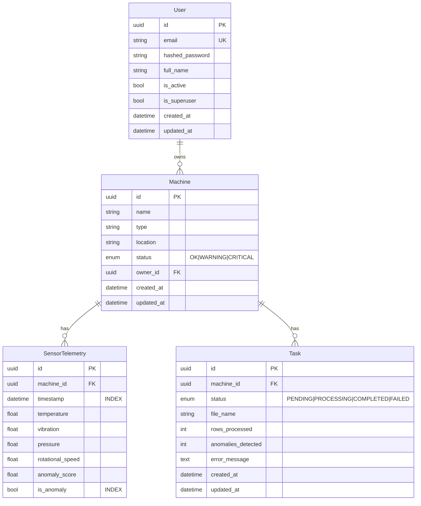

# Predictive Maintenance — Operations & Usage Wiki

A complete, hands-on guide: setup, configuration, database, API, the Gradio UI,
testing, troubleshooting, and production deployment.

---

## Table of contents

1. [Prerequisites](#1-prerequisites)
2. [Configuration](#2-configuration)
3. [Running with Docker](#3-running-with-docker)
4. [Running locally](#4-running-locally)
5. [Database & migrations](#5-database--migrations)
6. [Database schema](#6-database-schema)
7. [API reference](#7-api-reference)
8. [Using the Gradio UI](#8-using-the-gradio-ui)
9. [CSV format & ingestion](#9-csv-format--ingestion)
10. [Anomaly detection](#10-anomaly-detection)
11. [AI explanations (OpenRouter)](#11-ai-explanations-openrouter)
12. [Testing](#12-testing)
13. [Troubleshooting](#13-troubleshooting)
14. [Production deployment](#14-production-deployment)

---

## 1. Prerequisites

- **Python 3.11+**
- **PostgreSQL 14+** (16 recommended) — or just use Docker Compose
- **Docker + Docker Compose** (optional but easiest)
- An **OpenRouter API key** (optional; the system runs with a mock explainer
  without one)

---

## 2. Configuration

All configuration is environment-driven via `app/core/config.py`
(Pydantic Settings). Copy the template and edit:

```bash
cp .env.example .env
```

| Variable | Default | Purpose |
|---|---|---|
| `ENVIRONMENT` | `development` | `development` / `testing` / `production` |
| `DEBUG` | `true` | Verbose logging + SQL echo in dev |
| `API_V1_PREFIX` | `/api/v1` | API route prefix |
| `API_PORT` | `8000` | FastAPI port |
| `FRONTEND_PORT` | `7860` | Gradio port |
| `API_BASE_URL` | `http://localhost:8000` | URL the frontend calls |
| `POSTGRES_*` | see file | DB connection parts |
| `DATABASE_URL` | _(unset)_ | Full async DSN override |
| `JWT_SECRET_KEY` | _change me_ | HMAC secret for tokens |
| `ACCESS_TOKEN_EXPIRE_MINUTES` | `60` | Token lifetime |
| `OPENROUTER_API_KEY` | _(empty)_ | Enables real AI; empty ⇒ mock |
| `OPENROUTER_MODEL` | `google/gemini-2.5-pro` | Primary model |
| `OPENROUTER_FALLBACK_MODEL` | `google/gemini-2.5-flash` | Fallback model |
| `CSV_CHUNK_SIZE` | `50000` | Rows per processing chunk |
| `ISOLATION_FOREST_CONTAMINATION` | `0.02` | Expected anomaly fraction |
| `ISOLATION_FOREST_N_ESTIMATORS` | `100` | Trees in the forest |
| `MODEL_DIR` | `./models` | Persisted detectors |

Generate a strong secret:

```bash
python -c "import secrets; print(secrets.token_urlsafe(64))"
```

---

## 3. Running with Docker

```bash
docker-compose up --build
```

Services:

| Service | Port | Notes |
|---|---|---|
| `db` | 5432 | PostgreSQL 16, persistent volume `pgdata` |
| `api` | 8000 | Runs `alembic upgrade head` then `uvicorn` |
| `frontend` | 7860 | Gradio UI, talks to `api` over the compose network |

Run the test suite in a throwaway container:

```bash
docker-compose run --rm api pytest -v
```

Tear down (keep data): `docker-compose down` — or wipe volumes:
`docker-compose down -v`.

---

## 4. Running locally

```bash
python -m venv .venv
# Windows PowerShell:
.venv\Scripts\Activate.ps1
# bash:
source .venv/bin/activate

pip install -e ".[dev]"
cp .env.example .env
```

Start PostgreSQL (Docker is easiest):

```bash
docker-compose up -d db
```

Apply migrations and launch both processes:

```bash
python run.py migrate
python run.py            # API on :8000, Gradio on :7860
```

`run.py` also accepts `api`, `frontend`, or `migrate` to run a single target.

---

## 5. Database & migrations

Migrations use **async Alembic**; the DB URL and metadata come from app settings
and `app.models.Base` (not `alembic.ini`).

```bash
alembic upgrade head           # apply all migrations
alembic downgrade -1           # roll back one
alembic current                # show current revision
alembic history                # list revisions
alembic revision --autogenerate -m "add column x"   # create a new migration
```

The initial migration `0001_initial` creates all four tables, enums, and
indexes. Autogenerated revisions are auto-formatted by the `ruff` post-write hook.

---

## 6. Database schema



**Indexes of note:** composite `(machine_id, timestamp)` and
`(machine_id, is_anomaly)` on `sensor_telemetry` cover the dominant access
patterns (time-window scans and anomaly filtering per machine).

---

## 7. API reference

Base URL: `http://localhost:8000`. Interactive docs at `/docs` (Swagger) and
`/redoc`. All endpoints below are prefixed with `/api/v1`.

### Auth

| Method | Path | Auth | Description |
|---|---|---|---|
| POST | `/auth/register` | — | Create a user. Body: `{email, password, full_name?}` |
| POST | `/auth/login` | — | OAuth2 form (`username`=email, `password`). Returns `{access_token, token_type, expires_in}` |
| GET | `/auth/me` | ✅ | Current user |

### Machines

| Method | Path | Auth | Description |
|---|---|---|---|
| POST | `/machines` | ✅ | Create `{name, type, location?}` |
| GET | `/machines` | ✅ | List owned machines (`skip`, `limit`) |
| GET | `/machines/{id}` | ✅ | Get one |
| GET | `/machines/{id}/summary` | ✅ | Machine + telemetry/anomaly stats |
| PATCH | `/machines/{id}` | ✅ | Update fields/status |
| DELETE | `/machines/{id}` | ✅ | Delete (cascades telemetry + tasks) |

### Telemetry

| Method | Path | Auth | Description |
|---|---|---|---|
| POST | `/telemetry/upload/{machine_id}` | ✅ | Multipart CSV upload → `202 {task_id}` |
| GET | `/telemetry/tasks/{task_id}` | ✅ | Poll task status |
| GET | `/telemetry/machines/{id}/tasks` | ✅ | List a machine's tasks |
| GET | `/telemetry/machines/{id}/series` | ✅ | Recent readings as parallel arrays (charting) |
| GET | `/telemetry/machines/{id}/anomalies` | ✅ | Anomalous readings only |

### AI

| Method | Path | Auth | Description |
|---|---|---|---|
| GET | `/ai/explain/{machine_id}?window=N` | ✅ | Maintenance report for the last N readings |

### System

| Method | Path | Description |
|---|---|---|
| GET | `/health` | Liveness + `ai_enabled` flag |
| GET | `/` | Service metadata |

### Example: curl walkthrough

```bash
BASE=http://localhost:8000/api/v1

# register + login
curl -X POST $BASE/auth/register -H 'Content-Type: application/json' \
  -d '{"email":"ops@acme.io","password":"password123"}'
TOKEN=$(curl -s -X POST $BASE/auth/login \
  -d 'username=ops@acme.io&password=password123' | jq -r .access_token)

# create a machine
MID=$(curl -s -X POST $BASE/machines -H "Authorization: Bearer $TOKEN" \
  -H 'Content-Type: application/json' \
  -d '{"name":"Pump-1","type":"pump"}' | jq -r .id)

# upload telemetry
TID=$(curl -s -X POST $BASE/telemetry/upload/$MID \
  -H "Authorization: Bearer $TOKEN" -F file=@sensors.csv | jq -r .task_id)

# poll
curl -s $BASE/telemetry/tasks/$TID -H "Authorization: Bearer $TOKEN" | jq

# AI report
curl -s $BASE/ai/explain/$MID -H "Authorization: Bearer $TOKEN" | jq
```

---

## 8. Using the Gradio UI

Open <http://localhost:7860>. Tabs:

1. **Dashboard & Auth** — register or log in; the session token is held per
   browser tab. See your machines table (status colour-coded) and register new
   machines.
2. **Telemetry Upload** — pick a machine, choose a `.csv`, click *Upload &
   Process*. A live progress indicator polls the background task until it
   completes or fails.
3. **Analytics & Visuals** — pick a machine, *Load Charts*: interactive Plotly
   time series for temperature and vibration with **anomalies marked as red ×**,
   plus a stats panel.
4. **AI Assistant** — pick a machine and analysis window, *Generate Report* for
   the LLM (or mock) maintenance diagnosis and recommendations.

> Tip: after creating machines or uploading data, the machine dropdowns refresh
> automatically; use **🔄 Refresh** on the dashboard if needed.

---

## 9. CSV format & ingestion

Minimum: at least one sensor column. Canonical columns:

```
timestamp, temperature, vibration, pressure, rotational_speed
```

Accepted aliases (case-insensitive, spaces → underscores):

| Canonical | Aliases |
|---|---|
| `timestamp` | `time`, `datetime`, `date` |
| `temperature` | `temp` |
| `vibration` | `vib` |
| `rotational_speed` | `rpm`, `speed` |

Ingestion behaviour:

- Streamed in `CSV_CHUNK_SIZE`-row chunks (default 50k).
- Unknown columns dropped; missing sensor columns added as null.
- Non-numeric sensor values → `NaN`, imputed with column means before scoring.
- Missing/invalid timestamps → forward-filled, or a synthetic 1-second series.
- Each chunk is scored and **bulk-inserted** in its own transaction.
- On completion the machine status is derived from the anomaly ratio:
  `≥10%` → `CRITICAL`, `≥2%` or any anomalies → `WARNING`, else `OK`.

---

## 10. Anomaly detection

Default: **Isolation Forest** (`scikit-learn`) with `StandardScaler`. Tunables
via env: `ISOLATION_FOREST_CONTAMINATION`, `ISOLATION_FOREST_N_ESTIMATORS`.

The interface lives in `app/services/anomaly_service.py`:

```python
class AnomalyDetector(Protocol):
    def fit(self, features: np.ndarray) -> None: ...
    def predict(self, features: np.ndarray) -> DetectionResult: ...
    @property
    def is_fitted(self) -> bool: ...
```

To switch backends, change `get_default_detector()` (a `ZScoreDetector` is
provided; a PyTorch autoencoder could implement the same protocol). Models can be
persisted with `IsolationForestDetector.save/load` for per-machine reuse.

---

## 11. AI explanations (OpenRouter)

Set `OPENROUTER_API_KEY` to enable real LLM reports. The service uses the OpenAI
SDK pointed at `OPENROUTER_BASE_URL`, requests strict JSON, and tries
`OPENROUTER_MODEL` then `OPENROUTER_FALLBACK_MODEL`.

Without a key (or on any error) it returns a **deterministic mock** derived from
the telemetry statistics — so the feature always works, and CI/tests run offline.
The response's `is_mock` and `model_used` fields tell you which path produced it.

---

## 12. Testing

```bash
pytest                              # full suite, in-memory SQLite
pytest -v                           # verbose
pytest --cov=app --cov-report=term-missing
pytest src/tests/test_telemetry.py  # one module
```

The suite needs **no PostgreSQL and no network**: it uses an in-memory async
SQLite DB (the portable `GUID` type makes models backend-agnostic) and the mock
AI explainer. The background CSV task's session factory is monkeypatched onto the
test engine so end-to-end upload → process → query is exercised in-process.

Coverage spans auth, machine CRUD + ownership isolation, the detectors, CSV
validation/parsing, the full upload pipeline, and AI explanations.

---

## 13. Troubleshooting

| Symptom | Cause / Fix |
|---|---|
| `Could not validate credentials` | Missing/expired token — log in again. |
| Upload returns `404` | Machine not owned by the caller, or wrong id. |
| Task stuck `PENDING` | Background worker errored before start — check API logs; verify DB reachable. |
| `is_mock: true` unexpectedly | `OPENROUTER_API_KEY` unset or the API call failed (see logs). |
| Charts empty | No telemetry yet, or the task `FAILED` — check `error_message`. |
| Alembic can't connect | `POSTGRES_*` / `DATABASE_URL` wrong, or DB not up. |
| SQLite errors locally | Tests use SQLite automatically; the app itself needs PostgreSQL. |
| bcrypt backend warning | Harmless; pin `bcrypt` if noisy. |

Enable verbose logs with `DEBUG=true` (also echoes SQL in development).

---

## 14. Production deployment

Checklist:

- [ ] Strong `JWT_SECRET_KEY`; `ENVIRONMENT=production`, `DEBUG=false`.
- [ ] Restrict CORS `allow_origins` in `app/main.py` to known origins.
- [ ] Managed PostgreSQL with backups; run `alembic upgrade head` on deploy.
- [ ] Run `uvicorn`/`gunicorn` behind a reverse proxy (TLS termination).
- [ ] Persist `MODEL_DIR` on shared/object storage if running multiple replicas.
- [ ] For scale, move ingestion to a real task queue (Celery/Arq + Redis) — the
      `process_csv_task` function is already a self-contained unit of work.
- [ ] Ship JSON logs (already emitted in production) to your aggregator.
- [ ] Consider time-partitioning `sensor_telemetry` (or TimescaleDB) at high volume.

### Minimal production run

```bash
ENVIRONMENT=production DEBUG=false \
uvicorn app.main:app --host 0.0.0.0 --port 8000 --workers 4
```

> Note: with multiple Uvicorn workers, in-process `BackgroundTasks` run on the
> worker that accepted the upload. Use an external queue for guaranteed
> cross-worker processing and retries.
